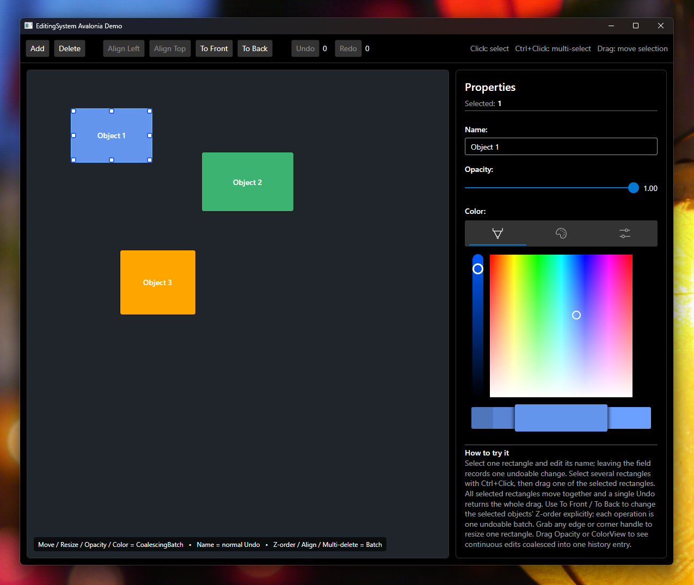

# EditingSystem

[](https://www.nuget.org/packages/Jewelry.EditingSystem) [](https://ci.appveyor.com/project/YoshihiroIto/editingsystem) [](LICENSE)

[English](README.md)

.NET 向けの Undo/Redo ライブラリです。通常のプロパティ編集、連続編集、バッチ処理、コレクション変更を同じ `History` で扱えます。実行時リフレクションに依存せず、NativeAOT に対応しています。

## インストール

```text
PM> Install-Package Jewelry.EditingSystem
```

## 基本パターン: `[Undoable]`

通常は、Undo/Redo したいプロパティを C# の partial プロパティとして宣言し、`[Undoable]` を付けます。

```cs
using Jewelry.EditingSystem;
using Jewelry.EditingSystem.Annotations;

[EditingHistory(nameof(history))]
public sealed partial class Document(History history)
{
    [Undoable]
    public partial string? Name { get; set; }

    [Undoable]
    public partial double X { get; set; }

    [Undoable]
    public partial double Y { get; set; }
}
```

Source Generator がプロパティの実装と履歴登録コードを生成します。

```cs
using var history = new History();
var document = new Document(history);

document.X = 100;
document.X = 200;

history.Undo(); // X == 100
history.Undo(); // X == 0
history.Redo(); // X == 100
```

`EditingHistory` には、非 null の `History` フィールド、プロパティ、または primary constructor parameter を指定できます。

### `INotifyPropertyChanged` との同時利用

`[Undoable]` は `INotifyPropertyChanged` を必須にしません。ただし対象型が `INotifyPropertyChanged` を実装している場合は、Source Generator が通知経路をコンパイル時に解決し、通常変更・Undo・Redo のすべてで `PropertyChanged` を発生させます。

```cs
using System.ComponentModel;
using Jewelry.EditingSystem;
using Jewelry.EditingSystem.Annotations;

[EditingHistory(nameof(history))]
public sealed partial class Document(History history) : INotifyPropertyChanged
{
    [Undoable]
    public partial string? Name { get; set; }

    public event PropertyChangedEventHandler? PropertyChanged;

    private void OnPropertyChanged(string propertyName)
    {
        PropertyChanged?.Invoke(this, new PropertyChangedEventArgs(propertyName));
    }
}
```

#### 通知メソッドを明示する

通知メソッド名が `RaisePropertyChanged` / `OnPropertyChanged` ではない場合は、`[EditingPropertyChanged]` で使用するメソッドを明示できます。

```cs
[EditingHistory(nameof(history))]
[EditingPropertyChanged(nameof(NotifyPropertyChanged))]
public sealed partial class Document(History history) : INotifyPropertyChanged
{
    [Undoable]
    public partial string? Name { get; set; }

    public event PropertyChangedEventHandler? PropertyChanged;

    private void NotifyPropertyChanged(string propertyName)
    {
        PropertyChanged?.Invoke(this, new PropertyChangedEventArgs(propertyName));
    }
}
```

`EditingPropertyChanged` で指定したメソッドは自動探索より優先され、通常変更・Undo・Redo のすべてで呼び出されます。指定できるのは、生成対象型からアクセス可能なインスタンス `void` メソッドで、引数は `string` または `PropertyChangedEventArgs` の1つです。ジェネリックメソッドは使用できません。

指定したメソッドが存在しない、シグネチャが異なる、またはアクセスできない場合は `JES006` error になります。

`EditingPropertyChanged` を指定していない場合、通知方法は次の順で探索します。

1. アクセス可能な `RaisePropertyChanged(string)`
2. アクセス可能な `OnPropertyChanged(string)`
3. アクセス可能な `RaisePropertyChanged(PropertyChangedEventArgs)`
4. アクセス可能な `OnPropertyChanged(PropertyChangedEventArgs)`
5. 対象 partial class 自身が宣言している `PropertyChanged` event

基底クラス上の `protected` 通知メソッドも対象です。アクセシビリティは Roslyn がコンパイル時に判定します。`INotifyPropertyChanged` を実装しているのに通知経路を解決できない場合、Undo/Redo は有効なまま `JES005` warning を報告します。

## CommunityToolkit.Mvvm との連携

CommunityToolkit.Mvvm との連携は主要な利用方法の一つです。従来の使用方法はそのまま利用できます。

```text
PM> Install-Package Jewelry.EditingSystem.CommunityToolkit.Mvvm
```

```cs
using CommunityToolkit.Mvvm.ComponentModel;
using Jewelry.EditingSystem;
using Jewelry.EditingSystem.CommunityToolkit.Mvvm;

[EditingHistory(nameof(_history))]
public sealed partial class SampleViewModel : ObservableObject
{
    private readonly History _history;

    public SampleViewModel(History history)
    {
        _history = history;
    }

    [Undoable, ObservableProperty]
    private string? name;

    [Undoable, ObservableProperty]
    public partial int Count { get; set; }
}
```

この連携では CommunityToolkit.Mvvm が生成する setter をそのまま Undo/Redo に利用します。そのため `PropertyChanged` / `PropertyChanging`、validation、command notification、recipient broadcast など CommunityToolkit.Mvvm の setter pipeline が Undo/Redo 時にも維持されます。

`ObservableObject` の継承は必須ではありません。既存の基底クラスがある場合は CommunityToolkit.Mvvm の `[INotifyPropertyChanged]` 属性も利用できます。

```cs
[INotifyPropertyChanged]
[EditingHistory(nameof(history))]
public sealed partial class DerivedViewModel(History history) : ExistingViewModelBase
{
    [Undoable, ObservableProperty]
    public partial int Count { get; set; }
}
```

CommunityToolkit.Mvvm 連携では、1 引数版の `OnXChanging(T value)` / `OnXChanged(T value)` を EditingSystem が使用します。アプリケーション固有処理には2引数版フックを利用してください。

> `Jewelry.EditingSystem.Annotations` の属性は EditingSystem 単体の partial property 用、`Jewelry.EditingSystem.CommunityToolkit.Mvvm` の属性は CommunityToolkit.Mvvm の `[ObservableProperty]` 連携用です。既存の CommunityToolkit.Mvvm コードは変更不要です。

## Batch と連続編集

複数の変更を1回の Undo として扱う場合は `Batch()` を使います。

```cs
using (history.Batch())
{
    document.X = 100;
    document.Y = 200;
}
```

スライダー、カラーピッカー、ドラッグ、3D ギズモなどの連続操作には `CoalescingBatch()` を使用します。

```cs
using (history.CoalescingBatch())
{
    document.X = 100;
    document.X = 120;
    document.X = 140;
}
```

同じ対象・同じプロパティへの連続変更は、最初の古い値と最後の新しい値だけにまとめられます。`[Undoable]` で生成されたプロパティは対象オブジェクトとプロパティ名を自動的に履歴キーとして使用します。

`Pause()` を使うと、初期値ロードなどを履歴に残さず実行できます。

```cs
using (history.Pause())
{
    LoadInitialValues();
}
```

## Undo 可能なコレクション操作

`History` が監視している `INotifyCollectionChanged` コレクションは、要素操作も Undo/Redo できます。`[Undoable]` プロパティにコレクションを代入すると、そのコレクションの変更が自動的に監視されます。

```cs
using System.Collections.ObjectModel;
using Jewelry.EditingSystem;
using Jewelry.EditingSystem.Annotations;

[EditingHistory(nameof(_history))]
public sealed partial class CollectionDocument
{
    private readonly History _history;

    public CollectionDocument(History history)
    {
        _history = history;
        using (history.Pause())
            Items = [];
    }

    [Undoable]
    public partial ObservableCollection<string> Items { get; set; }
}

using var history = new History();
var document = new CollectionDocument(history);

document.Items.Add("A");
document.Items.Add("B");

history.Undo(); // ["A"]
history.Redo(); // ["A", "B"]

document.Items.Move(1, 0); // ["B", "A"]
history.Undo();             // ["A", "B"]

document.Items.Clear();
history.Undo(); // ["A", "B"]
```

主な操作と通知は次のとおりです。

| 操作 | 初回通知 | Undo 通知 | Redo 通知 |
| --- | --- | --- | --- |
| `Add` / `Insert` | `Add` | `Remove` | `Add` |
| `Remove` / `RemoveAt` | `Remove` | `Add` | `Remove` |
| `Move` | `Move` | `Move` | `Move` |
| `Clear` | `Reset` | 要素ごとに `Add` | 要素ごとに `Remove` |
| `ClearEx(history)` | 要素ごとに `Remove` | 要素ごとに `Add` | 要素ごとに `Remove` |

`ClearEx`、`UnionWithEx`、`IntersectWithEx`、`ExceptWithEx`、`SymmetricExceptWithEx`、`RemoveWhereEx` は、コレクションプロパティとして監視されていない場合でも明示的に `History` へ記録できます。

```cs
var values = new List<int> { 1, 2, 3 };

values.ClearEx(history);
// values == []

history.Undo();
// values == [1, 2, 3]

history.Redo();
// values == []
```

セット操作も1回の Undo/Redo として記録できます。

```cs
using Jewelry.Collections;

var values = new ObservableHashSet<int>([10]);

values.UnionWithEx([20, 30], history);
// values == [10, 20, 30]

history.Undo();
// values == [10]

history.Redo();
// values == [10, 20, 30]
```

## 履歴数の制限

デフォルトでは履歴数に上限はありません。長時間動作するエディターでは上限を設定できます。

```cs
history.MaxUndoCount = 500;
```

## 手書き方式: 低レベル・オプション API

`[Undoable]` を基本パターンとして推奨します。

既存コードとの統合や、setter の制御を完全にアプリケーション側で持ちたい場合は、従来の `EditableModelBase` / `SetEditableProperty` / `RecordPropertyChange` / `RecordAppliedPropertyChange` も引き続き利用できます。

```cs
public sealed class ManualModel : EditableModelBase
{
    private int _value;

    public ManualModel(History history) : base(history)
    {
    }

    public int Value
    {
        get => _value;
        set => SetEditableProperty(v => _value = v, _value, value);
    }
}
```

この手書き方式は互換性のため維持しますが、一般的なプロパティでは `[Undoable]` の利用を優先してください。

## Source Generator と NativeAOT

`[Undoable]` の以下の処理はすべてコンパイル時に解決されます。

- `History` メンバーの解決
- partial property の実装生成
- `INotifyPropertyChanged` 実装判定
- `[EditingPropertyChanged]` で明示された通知メソッドの解決
- 通知メソッドの継承階層探索
- 通知メソッドのアクセシビリティ判定
- Undo/Redo setter の生成

実行時リフレクションや動的コード生成は使用しません。

## Avalonia デモ

[`EditingSystem/Jewelry.EditingSystem.Avalonia.Demo`](EditingSystem/Jewelry.EditingSystem.Avalonia.Demo) に Avalonia 12 のデモがあります。CommunityToolkit.Mvvm 連携、Undo/Redo、`Batch`、`CoalescingBatch`、複数オブジェクト編集、Z-order の Undo/Redo などを確認できます。



## Author

Yoshihiro Ito  
Twitter: [https://twitter.com/yoiyoi322](https://twitter.com/yoiyoi322)  
Email: yo.i.jewelry.bab@gmail.com

## License

MIT
