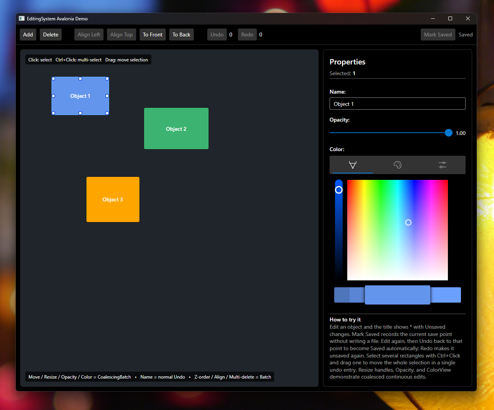

<div class="text-center py-4 py-md-5">
  
  <h1>Undo/redo for modern .NET editors</h1>
  <p class="lead mx-auto" style="max-width: 48rem;">Source-generated undo/redo for properties, continuous gestures, transactions, and observable collections — without runtime reflection.</p>
  <p>
    <a class="btn btn-primary btn-lg me-2 mb-2" href="docs/getting-started/">Get started</a>
    <a class="btn btn-outline-secondary btn-lg me-2 mb-2" href="https://www.nuget.org/packages/Jewelry.EditingSystem">NuGet</a>
    <a class="btn btn-outline-secondary btn-lg mb-2" href="https://github.com/YoshihiroIto/EditingSystem">GitHub</a>
  </p>
</div>

```shell
dotnet add package Jewelry.EditingSystem
```

<div class="row row-cols-1 row-cols-md-2 g-4 my-2">
  <div class="col">
    <div class="card h-100 bg-transparent border-secondary">
      <div class="card-body">
        <h2 class="h3 card-title"><i class="bi bi-lightning-charge text-info me-2" aria-hidden="true"></i>Generated properties</h2>
        <p class="card-text"><code>[Undoable]</code> partial properties record normal edits, Undo, and Redo through the same generated setter path.</p>
      </div>
    </div>
  </div>
  <div class="col">
    <div class="card h-100 bg-transparent border-secondary">
      <div class="card-body">
        <h2 class="h3 card-title"><i class="bi bi-sliders text-info me-2" aria-hidden="true"></i>Continuous edits</h2>
        <p class="card-text"><code>CoalescingBatch()</code> reduces a slider, drag, or color-picker gesture to one meaningful Undo step.</p>
      </div>
    </div>
  </div>
  <div class="col">
    <div class="card h-100 bg-transparent border-secondary">
      <div class="card-body">
        <h2 class="h3 card-title"><i class="bi bi-layers text-info me-2" aria-hidden="true"></i>Safe grouped edits</h2>
        <p class="card-text"><code>Transaction()</code> commits or restores tracked edits as a unit; <code>Batch()</code> groups changes that should remain applied.</p>
      </div>
    </div>
  </div>
  <div class="col">
    <div class="card h-100 bg-transparent border-secondary">
      <div class="card-body">
        <h2 class="h3 card-title"><i class="bi bi-collection text-info me-2" aria-hidden="true"></i>Collections and MVVM</h2>
        <p class="card-text">Track observable collection changes and preserve CommunityToolkit.Mvvm notifications, validation, commands, and messaging.</p>
      </div>
    </div>
  </div>
</div>

## Quick example

```csharp
using Jewelry.EditingSystem;
using Jewelry.EditingSystem.Annotations;

[EditingHistory(nameof(history))]
public sealed partial class Document(History history)
{
    [Undoable]
    public partial double X { get; set; }
}

using var history = new History();
var document = new Document(history);
document.X = 100;
history.Undo(); // X == 0
```

## Avalonia demo



> [日本語版はこちら](ja/)
